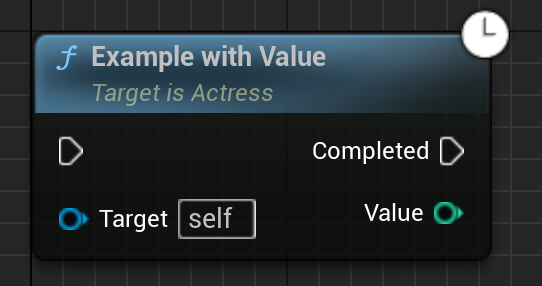

# Coroutines

Although generators are also coroutines, and it is possible to mix coroutines
provided by UE5Coro with any other library and/or your custom implementation;
for clarity, this term is used throughout this documentation to refer to
functions with a co_await expression or co_return statement in them that return
UE5Coro::TCoroutine\<\> or another compatible type.
The term subroutine refers to a function that does not have co_await, co_yield,
or co_return in its body, regardless of its return type.

TCoroutine is copyable and represents an individual coroutine call.
Calling the same coroutine multiple times with the same parameters (or no
parameters) will return different values each time.
These objects (unlike TGenerator) do not represent ownership of the coroutine,
and they may be safely discarded without affecting the running coroutine if
they're not needed.

Directly interacting with a coroutine's std::coroutine_handle is not supported,
and will almost certainly lead to undefined behavior.

Copying a TCoroutine value is allowed: the copy will refer to the same
invocation, and it will compare as equal to the original.
TCoroutine has a meaningless, but well-defined strict total order, which makes
it a suitable key for ordered containers.
GetTypeHash() and std::hash are also supported for unordered containers.
TCoroutine values remain valid indefinitely, even after their coroutines have
completed.

FVoidCoroutine (in the global namespace, by necessity) is provided as a USTRUCT
wrapper for TCoroutine\<\> to work around UHT limitations.
TCoroutine should be preferred wherever possible, as it is safer to use.

Due to engine limitations, FVoidCoroutine (but not TCoroutine) can be default
constructed without representing an actual coroutine.
Attempting to interact with the backing coroutine of a default-constructed
FVoidCoroutine is undefined behavior, but these values may still be compared
against each other, or checked for validity.
Valid FVoidCoroutines may be safely converted to TCoroutine\<\> and used without
limitations.
FVoidCoroutines returned by coroutines (as opposed to subroutines) are always
valid.

For coroutines, FVoidCoroutine and FForceLatentCoroutine (see below) pins are
hidden by default on BP node graphs.
If a function is changed into a coroutine after it has been used in BP, the
hidden pin(s) might appear on the node graph, but this is harmless and does not
affect behavior as long as these pins remain disconnected.
If desired, affected nodes may be recreated to fix their visuals.

## Return types

TCoroutine\<T\> lets a coroutine co_return T.
TCoroutine\<\> is the same type as TCoroutine\<void\>.
The \<\> may be omitted if the compiler can deduce the type:
`TCoroutine Coro = Foo();`

A (non-void) coroutine return type must be at least _DefaultConstructible_,
_MoveAssignable_, and _Destructible_.
Full functionality also requires _CopyConstructible_.
It's possible that a coroutine completes without providing a return value.
In this case, the return value is a default-constructed T.

TCoroutine\<T\> implicitly converts to TCoroutine\<\> to provide a
return-type-erased handle to the coroutine invocation.
It is safe to object slice a TCoroutine\<T\> to TCoroutine\<\> and static_cast
it back to the original type (with exactly the same T).

RTTI or reflection functionality to discover T at runtime is not provided.

## Execution modes

TCoroutine is driven by two separate systems appearing as one:

|                          |Async mode |Latent mode                         |
|--------------------------|-----------|------------------------------------|
|UObject owner/`this`      |Ignored    |[Lifetime tracked](#latent-lifetime)|
|Coroutine lifetime        |Independent|Owned by the engine                 |
|Home thread               |Any        |Game thread                         |
|Blueprint node            |Regular    |Regular or 🕒                        |
|Multithreading            |✅          |✅                                   |
|Launching a coroutine     |🐇          |🐢                                   |
|Awaiting `TLatentAwaiter`s|🐢          |🐇                                   |
|Awaiting anything else    |🐇          |🐇                                   |

Which mode a coroutine will use is determined at compile time, based on the
following logic:

1. If a coroutine has a parameter that decays to FLatentActionInfo,
   UE5Coro::TLatentContext, or FForceLatentCoroutine, it will run in latent mode.
   Having more than 1 of these parameters will not compile.
2. Without any of the special parameters above, it will run in async mode.
3. Some functions (e.g., virtuals on UE5CoroGAS classes) have their own custom
   rules, documented separately.

Using co_yield in a function returning a TCoroutine-compatible type will not
compile.
Subroutines may take or return any of these types, and they will be unaffected
until they're turned into coroutines by the presence of co_await and/or
co_return inside the function body.
Due to the return-type requirement, UE5Coro will happily live together with
multiple coroutine implementations in the same project, as long as they don't
try and process TCoroutine.

### Async mode

This is the simpler, better-performing of the two: it's very similar to how a
standalone C++ function would execute.
The function's lifetime is not managed, and it's responsible for its own
cleanup.
Class member functions are also responsible for tracking the lifetime of their
objects: resuming a coroutine on a deleted object is just as bad as calling a
function on one if it attempts to access `this`.

BlueprintCallable and/or BlueprintPure coroutine UFUNCTIONs in async mode will
synchronously continue BP execution at the first co_await or co_return, and the
rest of the coroutine will execute independently.

Coroutines in async mode will automatically spin up a latent action if they need
one (usually, due to awaiting a type that's matched by the TLatentAwaiter
concept).
This has more overhead than a latent coroutine reusing its existing latent
action, and doing so needs access to a world, which is read from GWorld.

As a result, async coroutines may only await TLatentAwaiters if GWorld is valid.
Usually, this is the case if the coroutine moves to the game thread before
attempting to interact with latent actions (which is a requirement for those
awaiters anyway), but there are some unusual situations where GWorld is not
valid.
In this case, attempt to move the co_await to a different point in time, use an
async equivalent to the affected latent awaiter, if available, or change the
coroutine's execution mode to latent.

Most of the memory associated with a coroutine is freed when control leaves the
coroutine body, either explicitly via co_return, or implicitly, by falling off
the final `}` in the case of TCoroutine\<\>.
This happens on the thread that the coroutine was last running on.
A small amount of memory is retained as long as there's at least one TCoroutine
referring to the coroutine execution.
This is where the co_returned result is stored, for instance.

### Latent mode

This mode matches BP behavior as closely as possible instead of C++'s.
It's focused on convenience and automatically handles various tasks related to
the backing latent action, and tracking the lifetime of its target UObject.
The benefits of this tracking are discussed in the
[next section](#latent-lifetime).

The function will search for a latent action registered for the provided
FLatentActionInfo, and if there is one, it will **do nothing and return**,
matching the behavior of most latent UFUNCTIONs provided by the engine.
Otherwise, it will register a latent action, and the coroutine's lifetime is
controlled by the latent action manager.
This duplicate prevention does not happen if a FLatentActionInfo parameter is
not provided.

A few virtual functions from FPendingLatentAction are exposed as
[latent callbacks](LatentCallback.md) for coroutines, but this functionality is
rarely needed.
RAII within the coroutine body with `ON_SCOPE_EXIT` does most of the job.

If a FLatentActionInfo or TLatentContext parameter is provided, it determines
the coroutine's target for the engine's latent action manager, and its world
context.
Otherwise, for FForceLatentCoroutine, the world and target will be determined by
the first function parameter (which will be `this` for non-static members).
Finding no valid world for the coroutine is fatal.

The coroutine completing will resume its caller blueprint on the node's latent
exec pin.
Canceled coroutines will not resume BP.
C++ callers do not benefit from this (unless using Latent::Chain), but unlike
BP, they can interact with the function's return value.

> [!NOTE]
> Although it is expected that coroutines taking FLatentActionInfo are used to
> implement latent UFUNCTIONs for BP, this is not a requirement.
>
> UE5Coro will do its job when presented with a UFUNCTION without the necessary
> meta specifiers, but this will result in a BP node without 🕒, that does not
> provide a valid value to the latent info parameter when called.
> This is unlikely to work correctly.
>
> TLatentContext and FForceLatentCoroutine are recommended for latent coroutines
> called from C++.

Latent coroutines are normally expected to interact with the game thread, and
they're owned by the latent action manager.
There is a fast path for awaiters that match the UE5Coro::TLatentAwaiter
concept that avoids creating a latent action for each awaiter (unlike the
built-in latent BP nodes, which usually create a new one for each call).
TLatentAwaiters will also react within one tick to
[cancellations](Cancellation.md), instead of a variable amount of time later.

Awaiting anything else puts the coroutine into a special mode, where its
lifetime is temporarily extended beyond its backing latent action's.
If the engine decides to destroy the latent action while in this state, the
coroutine is guaranteed to remain valid long enough for cleanup (destroying
local variables, etc.) to safely run before the coroutine itself is destroyed.
The game thread is **NOT** blocked when this happens.
The coroutine returning to the game thread restores its normal execution and
transfers its lifetime back to the latent action manager.

The latent action manager deleting the coroutine's latent action for any reason
counts as a forced cancellation that will ignore any cancellation guards to
ensure that the coroutine cleans up.
Regardless of which thread a latent coroutine was running on, cleanup
**due to cancellation** always happens on the game thread.

> [!NOTE]
> If a latent coroutine runs to completion while not on the game thread, cleanup
> will happen on that thread before the coroutine is considered complete,
> instead of the game thread.
> This is due to C++ language rules, and it cannot be changed.
>
> Make sure to use `co_await MoveToGameThread()` before the coroutine ends if
> this is not desired, e.g., because there are latent awaiters in scope.

#### Latent lifetime

Latent coroutines' lifetimes being controlled by the latent action manager is
highly beneficial, as it provides a measure of protection against running on an
invalid object, which could then lead to data corruption and/or crashes.

This is perhaps best illustrated with direct line-by-line comparisons, showing
the code that does _not_ need to be written for a latent coroutine:

<table><tr><td>

```cpp
TCoroutine<> AActress::MemberAsync()
{
    check(IsInGameThread());
    TWeakObjectPtr WeakThis = this;
    co_await MoveToTask();
    auto Value = HeavyProcessing();
    co_await MoveToGameThread();
    if (!WeakThis.IsValid())
        co_return;
    /*this->*/SetValue(std::move(Value));
}
```
</td><td>

```cpp
TCoroutine<> AActress::MemberLatent(FForceLatentCoroutine = {})
{


    co_await MoveToTask();
    auto Value = HeavyProcessing();
    co_await MoveToGameThread();


    /*this->*/SetValue(std::move(Value));
}
```
</td></tr><tr></tr><tr><td> <!-- Extra row to work around the default CSS -->

```cpp
static TCoroutine<> Async(AActress* Target)

{
    check(IsInGameThread());
    TWeakObjectPtr WeakTarget = Target;
    co_await MoveToTask();
    auto Value = HeavyProcessing();
    co_await MoveToGameThread();
    if (!WeakTarget.IsValid())
        co_return;
    Target->SetValue(std::move(Value));
}
```
</td><td>

```cpp
static TCoroutine<> Latent(AActress* Target,
                           FForceLatentCoroutine = {})
{


    co_await MoveToTask();
    auto Value = HeavyProcessing();
    co_await MoveToGameThread();


    Target->SetValue(std::move(Value));
}
```
</td></tr></table>

If a UObject `this` or Target is destroyed before the coroutine moves back to
the game thread, a latent coroutine would have its latent action destroyed,
which in turn cancels the coroutine execution, making sure that SetValue does
not run.

Since UObject lifetimes and latent actions are both strongly tied to the game
thread, accessing the coroutine's target UObject is only safe to do on the game
thread.
There's still nothing stopping a garbage collection while the coroutine is
running on another thread.

Currently, only the coroutine's target UObject (provided by FLatentActionInfo or
TLatentContext, or the first parameter if FForceLatentCoroutine is used) is
tracked this way.
Other UObjects might need manual weak/strong pointers.

Of course, the UPROPERTYs of the target UObject itself are tracked by the GC,
making this feature very convenient and powerful in practice for most member
coroutines.
If a latent coroutine only interacts with its target object and/or other objects
accessed only through its UPROPERTYs, there's no additional handling required.

> [!TIP]
> The local variables of a coroutine are not UPROPERTYs, so after each co_await,
> there's always a chance that some untracked UObject is now gone and the
> pointer has become dangling.
> `IsValid(Ptr)` cannot be used to check the validity of a dangling raw pointer.

# TCoroutine

TCoroutine\<\> is a convenience shortcut for TCoroutine\<void\>.
They are the same type.
For coroutines returning a value, another type parameter can be provided instead
of void.
This type parameter must be at least _DefaultConstructible_, _MoveAssignable_,
and _Destructible_.
Full functionality also requires _CopyConstructible_.

Control leaving the body of a coroutine returning TCoroutine\<T\> (T≠void)
without a co_return statement is undefined behavior, unless the coroutine was
successfully [canceled](Cancellation.md).
In this case, its return value will be a default-constructed T().

TCoroutine has various methods on it to interact with the coroutine from
synchronous/blocking code that isn't coroutine aware.
It is also [awaitable](Implicit.md#tcoroutinet) by other coroutines.

Accessing the std::coroutine_handle or the coroutine promise from a TCoroutine
is not supported, and will likely result in undefined behavior.

## Sync->Async transitions

Other than the obvious method of calling a coroutine, there are a few
convenience shortcuts to generate a TCoroutine when authoring a full coroutine
is not desired.

### static const TCoroutine\<\> TCoroutine\<\>::CompletedCoroutine

This field contains a handle to a coroutine with a `void` result that has
already completed successfully.
It's useful as a default value of TCoroutine\<\> fields.

### static TCoroutine\<std::decay_t\<V\>\> TCoroutine\<\>::FromResult(V&& Value)

This function can be used to convert a value to a coroutine handle that acts as
if a coroutine has immediately and successfully co_returned that value.
Since the function parameter is subject to decay, this method will work even if,
e.g., V is an lvalue reference.
An explicit type parameter may be provided to `TCoroutine<T>::FromResult` if
this is not desired.

## Async->Sync transitions

Consuming an asynchronous operation from synchronous code can be problematic.
TCoroutine provides the usual primitives to block or register callbacks, on top
of being awaitable from other coroutines.

### const T& TCoroutine\<T\>::GetResult() const

Blocks the caller until the coroutine's completion, and returns a reference to
the coroutine's result.
Since multiple coroutine handles may be observing the coroutine, this is a const
reference.

### T&& TCoroutine\<T\>::MoveResult()

Blocks the caller until the coroutine's completion, and provides a ready-to-move
rvalue reference to its result.
Callers are responsible for ensuring that only one thread does this, and at most
once.
No further GetResult or MoveResult calls are permitted after calling MoveResult.

### bool TCoroutine\<\>::IsDone() const

Returns `true` if the coroutine has completed for any reason, including being
canceled.
Retrieving this flag is non-blocking.

### bool TCoroutine\<\>::WasSuccessful() const noexcept

Returns `true` if the coroutine has completed successfully.
Cancellations after a successful completion are no-ops and don't affect this
value.
Retrieving this flag is non-blocking.

### bool TCoroutine\<\>::Wait(uint32 WaitTime, bool bIgnoreThreadIdleStats)

This function blocks its caller, waiting for the coroutine's completion until
`WaitTime` milliseconds have passed (defaults to infinite).

For the `bIgnoreThreadIdleStats` parameter, see `FEvent::Wait` in the engine.

Returns IsDone(), i.e., `true` on success, `false` on timeout.

### void TCoroutine\<?\>::ContinueWith(? Callback)

There are multiple overloads of this function, on both TCoroutine\<\> and
TCoroutine\<T\>.
They take a callable object that takes either no parameters, or one compatible
with T, and call it when the coroutine has completed.
Calling ContinueWith on a coroutine that has already completed will execute the
callback immediately.

ContinueWith is thread-safe and guarantees exactly one execution of `Callback`
(unless the coroutine never finishes, in which case, zero).

If the coroutine is currently running or suspended, the callback will be called
on the thread where the coroutine ends (always the game thread for latent
coroutines), or synchronously on the current thread if the coroutine has already
completed.

Example:
```cpp
using namespace UE5Coro;

TCoroutine<int> Coro = ...;
// Taking the result
Coro.ContinueWith([](int Result)
{
    UE_LOGFMT(LogTemp, Display, "Coroutine completed with result {0}", Result);
});
// Ignoring the result
Coro.ContinueWith([]
{
    UE_LOGFMT(LogTemp, Display, "Coroutine completed");
});
```

### void TCoroutine\<?\>::ContinueWithWeak(? StrongPtr, ? Callback)

This function also comes with numerous overloads.

The first parameter is a strong pointer to an object, such as a UObject\*,
TSharedPtr, or std::shared_ptr.
The callback may take 0, 1, or 2 parameters: nothing, a parameter compatible
with T, or a parameter compatible with the strong pointer and another with T.

The coroutine will appropriately weak reference the object (TWeakObjectPtr,
TWeakPtr, std::weak_ptr) and will only execute the callback if the object is
still alive at the time the coroutine completes.

Like ContinueWith, this function is thread-safe and may be called at any time
before or after the coroutine has completed on any thread, but it doesn't bestow
additional thread safety upon the strong pointer itself: UObject*s must be used
from the game thread, NotThreadSafe TSharedPtrs require the coroutine itself to
appropriately synchronize (or be single-threaded) before it completes, etc.

The callback will be called on the thread where the coroutine ends (always the
game thread for latent coroutines), or synchronously on the current thread if
the coroutine has already finished.

Example:
```cpp
using namespace UE5Coro;

void AActress::Subroutine(TSharedPtr<SButton> Button)
{
    TCoroutine<int> Coro = ...;
    Coro.ContinueWithWeak(this, [this]
    {
        UE_LOGFMT(LogTemp, Display, "Coroutine completed");
        check(IsValid(this));
    });

    // Not lambda capturing the TSharedPtr lets the button be destroyed
    // elsewhere, and ContinueWithWeak will only run the lambda with a valid
    // SButton*
    Coro.ContinueWithWeak(Button, [](SButton* InButton, int Result)
    {
        UE_LOGFMT(LogTemp, Display, "Coroutine completed with result {0}", Result);
        InButton->SimulateClick();
    });
}
```

## Cancellation

### void TCoroutine\<\>::Cancel()

Marks the coroutine as canceled, which will cause its current (if it's suspended)
or next (if it isn't) co_await to divert and clean up instead of continuing
execution.
Coroutines have facilities to block or defer this kind of cancellation request.

Cancellation has [its own documentation page](Cancellation.md).

## Miscellaneous features

### static void TCoroutine\<\>::SetDebugName(const TCHAR* Name)

When called from within a coroutine, attaches a debug name to the
currently-executing coroutine, which will be displayed by UE5Coro.natvis.
This function does nothing in Shipping builds, so calls to it with TEXT literals
are OK to leave in if you don't want to #ifdef/macro its use.

Behavior is undefined if this is called from outside a coroutine.

### TCoroutine::operator==, TCoroutine::operator<=>, GetTypeHash, std::hash

TCoroutines are suitable to use as keys in ordered containers, and they provide
hashes for unordered Unreal and STL containers.
The order of TCoroutines is meaningless, but it is strict and total across all
type parameters.

# FVoidCoroutine

This type is provided as a USTRUCT wrapper for TCoroutine\<\>, and the two
types implicitly convert to each other.
Its main purpose is to enable UFUNCTION coroutines to be written, and it is
hidden from BP when used as the return value of such a function.

Due to Unreal limitations, this type is default constructible, and does not
support co_return values.

Default-constructed FVoidCoroutines, or TCoroutines converted from one are
invalid; attempting to use functionality that accesses the null underlying
coroutine is undefined behavior.
These objects should only ever be created as the return value of a coroutine or
as a copy of one.

To return a value from a latent UFUNCTION, use a reference parameter:
```cpp
UFUNCTION(BlueprintCallable, meta = (Latent, LatentInfo = LatentInfo))
FVoidCoroutine ExampleWithValue(int& Value, FLatentActionInfo LatentInfo)
{
    co_await Latent::NextTick();
    Value = 1;
}
```



## bool FVoidCoroutine::IsValid() const

Returns true if there is a coroutine backing this object, false if it was
default constructed.
If the object is valid, it may be safely converted or object sliced to
TCoroutine\<\>.

# FForceLatentCoroutine

This USTRUCT is empty, but its presence on a coroutine's parameter list makes it
run in latent execution mode.
This is useful to benefit from the object lifetime protections given by the
latent action manager, while still providing a function that can be easily
called from C++.
BlueprintCallable functions taking this parameter will **NOT** produce latent
nodes, despite running as a latent action.
The latent action's target will be the function's first parameter (`this` on
non-static members), and the latent action will run in the world it returns from
GetWorld().

It is recommended to give these a default value, so that they're hidden when
used:
```cpp
// Declaration
static TCoroutine<> Example(UObject* WorldContext, int A, int B, int C,
                            FForceLatentCoroutine = {});
// Usage
Example(this, 1, 2, 3);
```

# TLatentContext\<T\>

Similarly to FForceLatentCoroutine, the presence of this parameter will make a
coroutine run in latent mode.
The world context and latent action target are explicitly passed in this struct,
disabling the automatic detection logic.

This struct implicitly converts from T\*, and provides `->` and prefix `*`
operators for convenience to act as the T\* that it was converted from.
Its main intended use is for latent lambda coroutines, where the first parameter
will always be the lambda object, which is not a suitable world context.

> [!WARNING]
> Coroutine lambdas are very easy to get wrong, especially if they have captures.
> Make sure they're stored in a suitably long-lived variable in this case.
> Refer to the
> [C++ Core Guidelines](https://isocpp.github.io/CppCoreGuidelines/CppCoreGuidelines#cpcoro-coroutines)
> for best practices.

For instance, this lambda will safely run in latent mode, essentially letting
BeginPlay to be authored as a coroutine, despite engine limitations:
```cpp
void AActress::BeginPlay() // Cannot return TCoroutine<>, since it's an override
{
    [](TLatentContext<AActress> This) -> TCoroutine<>
    {
        co_await Async::MoveToTask();
        auto Data = ComputeExpensiveThing();
        co_await Async::MoveToGameThread();
        This->SetData(Data); // Latent mode: This is known to be valid
    }(this);
}
```

To write a latent lambda that does not care about what's in the context, the
following shorter syntax is available:
```cpp
[](TLatentContext<>) -> TCoroutine<>
{
    co_return; // Coroutine goes here
}(this);
```

For advanced use (mainly if the coroutine target does not have a world, such as
an engine subsystem or CDO), the target and world may be provided separately.
This is dangerous, and it needs additional care with lifetime management.
```cpp
[](TLatentContext<>, int Something) -> TCoroutine<>
{
    co_return; // Coroutine goes here
}({this, MyWorld}, 1);
```

TLatentContext intentionally does not store its contents in an ObjectPtr or
UPROPERTY.
Its only intended use is to be directly passed to a latent coroutine, which
already provides UObject lifetime management for the coroutine target and world
through the engine's latent action manager.
